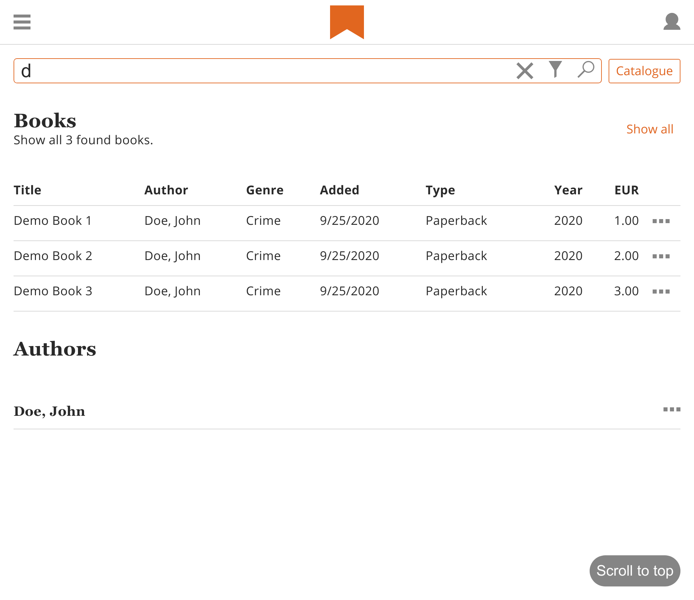
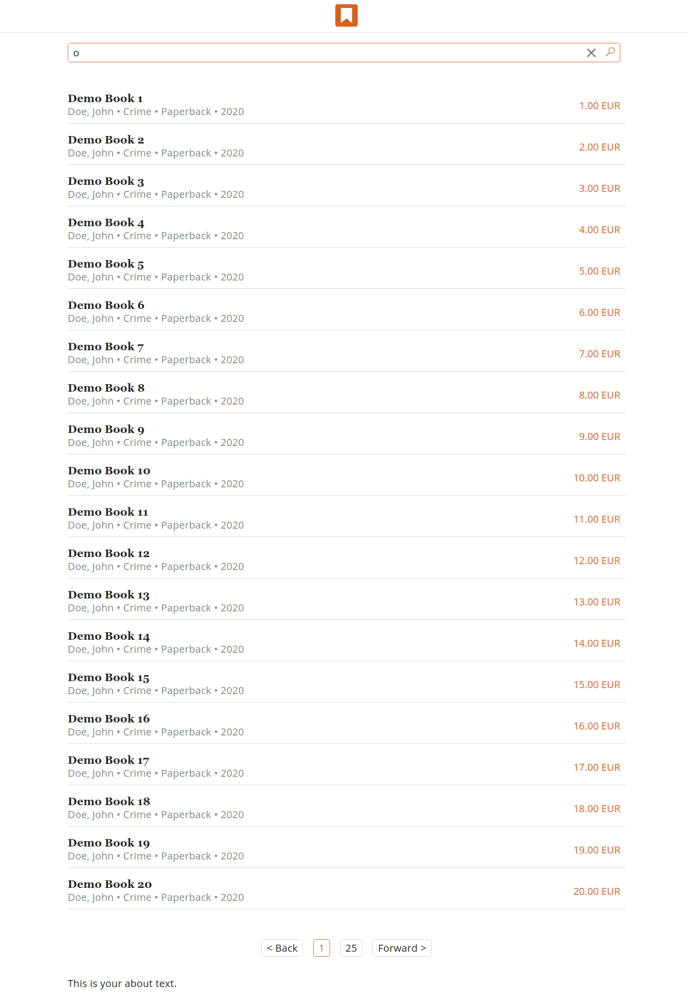

# incwadi warehouse

incwadi is a book database to manage your books.

## Repositories

|Name         |Repo                                                 |Description                      |
|-------------|-----------------------------------------------------|---------------------------------|
|doc          |<https://github.com/incwadi-warehouse/docu>          |Documentation                    |
|core         |<https://github.com/incwadi-warehouse/core>          |Backend                          |
|catalog      |<https://github.com/incwadi-warehouse/catalog>       |UI                               |
|shop         |<https://github.com/incwadi-warehouse/shop>          |UI                               |
|settings     |<https://github.com/incwadi-warehouse/settings>      |UI                               |
|orders       |<https://github.com/incwadi-warehouse/orders>        |UI                               |
|monorepo-js  |<https://github.com/incwadi-warehouse/monorepo-js>   |Containing code for UI projects  |
|monorepo-php |<https://github.com/incwadi-warehouse/monorepo-php>  |Containing PHP Libraries         |
|monorepo-go  |<https://github.com/incwadi-warehouse/monorepo-go>   |Containing Golang Libraries      |

## Get Started

Installation with Docker is recommended.

- [Setup with Docker](setup/docker.md)
- [Setup Manually](setup/manual.md)

- [Information for Admins](admin/)
- [Information for Developers](dev/)

## Screenshot

inventory

find
